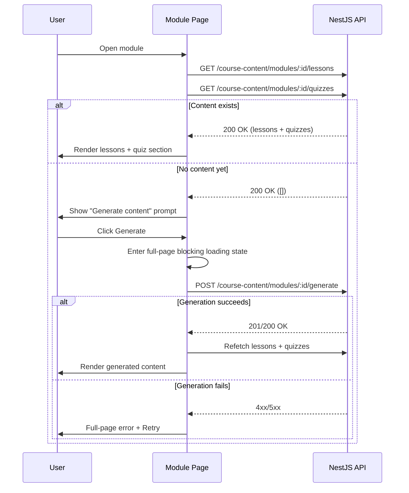

# Product Requirements Document: Dashboard, Courses & Course Content Module

## 1. Executive Summary

This document specifies the frontend implementation of the authenticated dashboard experience: browsing and creating courses, viewing a course's module structure, and consuming AI-generated lesson/quiz content per module. It builds directly on top of the existing Authentication Module PRD — this document assumes `useAuthStore`, the Axios client with its 401 refresh interceptor, and the protected `(protected)` route group already exist and work.

## 2. Goals and Scope

### Goals

* Let a logged-in user browse all courses, see their own created courses, and create a new course.
* Let a user drill into a course to see its modules, then into a module to see its content.
* Trigger on-demand AI content generation for a module that has no lessons yet, with a clear blocking loading state.
* Surface quiz questions per module for self-review, without pretending to track progress the backend doesn't support.

### Scope

* **In Scope:** Top nav (profile, courses, my courses), course list/detail views, course creation form, module list, module content view (lessons + quizzes), on-demand content generation flow.
* **Out of Scope (explicitly deferred):**
  * Course update / delete (endpoints not built yet).
  * Quiz answer submission, scoring, or any progress tracking (no backend endpoint exists for this — see §11 Known Gaps).
  * Lesson/quiz editing.

## 3. Technology Stack

Same as the Authentication Module PRD: Next.js 16 (App Router), TypeScript, Axios, TanStack Query, Zustand (auth only — no new global store is introduced here), React Hook Form + Zod, shadcn/ui, Tailwind CSS.

State handling for this module is intentionally **TanStack Query only**. Courses, modules, lessons, and quizzes are server state with no cross-cutting client state (unlike the access token), so no new Zustand store is needed.

## 4. API Surface Used

| Method | Endpoint | Purpose |
|---|---|---|
| GET | `/auth/profile` | User profile details (nav profile panel) |
| GET | `/courses` | All courses (Browse Courses) |
| GET | `/courses/user/me` | Current user's created courses (My Courses) |
| GET | `/courses/:id` | Single course detail |
| POST | `/courses` | Create a new course — body: `{ title, topic, skillLevel }` |
| GET | `/courses/modules/:courseId` | Modules belonging to a course |
| GET | `/course-content/modules/:moduleId/lessons` | Lessons for a module |
| GET | `/course-content/modules/:moduleId/quizzes` | Quiz questions for a module |
| POST | `/course-content/modules/:moduleId/generate` | Trigger AI generation of lessons + quizzes for a module |
| GET | `/course-content/lessons/:id` | Single lesson by id |
| GET | `/course-content/quizzes/:id` | Single quiz question by id |

> **Note:** `GET /courses/modules/:courseId` is taken as given from the backend controller shape provided; the frontend does not assume a more RESTful `/courses/:courseId/modules` alternative.

## 5. User Stories

* **US1:** As a user, I want to see my profile details from the nav bar without leaving my current page.
* **US2:** As a user, I want to browse all available courses so I can find something to learn.
* **US3:** As a user, I want to see only the courses I've created, separately from all courses.
* **US4:** As a user, I want to create a new course by giving a title, topic, and skill level, and land straight in its module view afterward.
* **US5:** As a user, I want to open a course and see its modules laid out in order.
* **US6:** As a user, I want to open a module and read its lessons; if none exist yet, I want the system to generate them for me.
* **US7:** As a user, I want to review quiz questions for a module to self-check my understanding, understanding that my answers aren't saved anywhere yet.

## 6. Route Architecture

Nested under the existing `(protected)` layout group so auth bootstrap/guarding is inherited automatically.

```text
/dashboard                                   — hub / overview
/dashboard/courses                           — Browse Courses (GET /courses)
/dashboard/courses/my                        — My Courses (GET /courses/user/me)
/dashboard/courses/new                       — Create Course form (POST /courses)
/dashboard/courses/[courseId]                — Course detail + module list
/dashboard/courses/[courseId]/modules/[moduleId]  — Module content (lessons + quizzes)
```

The nav bar's **profile** action does not route to a new page — it opens a **modal/sheet** in place, since a full profile page adds a navigation detour for what is a read-only details view. (Assumption — flag if a dedicated `/dashboard/profile` page is preferred instead; trivial to swap.)

## 7. Detailed Flow Specifications

### 7.1 Top Nav Bar

Persistent across all `/dashboard/*` routes.

* **Profile control:** Avatar/initials button, right-aligned. On click, opens a slide-over or modal (`ProfilePanel`) that fires `useProfileQuery` (`GET /auth/profile`) and renders name, email, and any other fields the endpoint returns. Loading state: skeleton rows inside the panel, not a full-page blocker — this is a peripheral action, not a navigation.
* **Courses** nav link → `/dashboard/courses`.
* **My Courses** nav link → `/dashboard/courses/my`.
* **New Course** button (visually a primary pill button, not a plain nav link, since it's the dashboard's main conversion action) → `/dashboard/courses/new`.

### 7.2 Browse Courses (`/dashboard/courses`)

* `useCoursesQuery` → `GET /courses`. Renders a responsive grid of `CourseCard` components (title, topic, skill level badge).
* Clicking any `CourseCard` navigates to `/dashboard/courses/[courseId]`.
* Empty state: "No courses yet" with a CTA into `/dashboard/courses/new`.
* Loading state: skeleton grid (3–6 placeholder cards), not a full-page blocker.

### 7.3 My Courses (`/dashboard/courses/my`)

* Identical layout/component (`CourseCard`, same click-through behavior) to Browse Courses, but backed by `useMyCoursesQuery` → `GET /courses/user/me`.
* Empty state copy is distinct from Browse Courses: "You haven't created a course yet" + CTA to `/dashboard/courses/new`, since an empty *My Courses* means something different from an empty global course catalog.

### 7.4 Create Course (`/dashboard/courses/new`)

* Form fields: `title` (text), `topic` (text), `skillLevel` (select — assume `beginner | intermediate | advanced` unless the backend enum differs; confirm before locking the Zod enum).
* Validated with React Hook Form + Zod, mirroring the shape of `POST /courses`.
* `useCreateCourseMutation`:
  * On success: invalidate `courses` and `courses:my` query caches, then `router.push(`/dashboard/courses/${newCourse.id}`)` — landing the user directly in the new course's module view, per your confirmed choice.
  * On error (400/422): inline field errors via the Zod resolver, same pattern as the Auth PRD's registration form.
  * On error (500/network): global toast, form stays filled so the user doesn't lose their input.
* Submit button shows a pending state (disabled + spinner) — this is a normal mutation, not the long-running generation flow, so no full-page block here.

### 7.5 Course Detail (`/dashboard/courses/[courseId]`)

* `useCourseQuery(courseId)` → `GET /courses/:id` for the header (title, topic, skill level, description if present).
* `useModulesQuery(courseId)` → `GET /courses/modules/:courseId` for the module list, rendered as an ordered list of `ModuleRow` items (module title/number).
* Clicking a `ModuleRow` navigates to `/dashboard/courses/[courseId]/modules/[moduleId]`.
* Update/Delete actions are **not rendered** in this version — no edit or trash icon anywhere on this page. (Per your note: may be added later once the backend supports it.)

### 7.6 Module Content (`/dashboard/courses/[courseId]/modules/[moduleId]`)

This is the most stateful screen in the module. On mount:

1. `useLessonsQuery(moduleId)` → `GET /course-content/modules/:moduleId/lessons`.
2. In parallel, `useQuizzesQuery(moduleId)` → `GET /course-content/modules/:moduleId/quizzes`.
3. **If both come back empty** (no lessons and no quizzes generated yet):
   * Show an explicit "Generate content" prompt rather than auto-triggering — generation is a real cost/latency operation and the user should knowingly kick it off. (Assumption: confirm if you'd rather auto-trigger silently on first visit instead.)
   * On click, call `useGenerateContentMutation(moduleId)` → `POST /course-content/modules/:moduleId/generate`.
   * **While generation is in flight: full-page blocking loading state**, per your requirement — the rest of the dashboard (nav included) is not interactable, with a message like "Building your module — this can take a moment." No navigating away mid-generation.
   * On success: invalidate the lessons and quizzes queries for this `moduleId` and re-render the content view with the freshly generated data.
   * On failure: full-page error state with a retry action — do not silently fall back to an empty screen.
4. **If content already exists:** render directly — lessons first (in order), then a "Quiz" section below.

**Lesson rendering:** each lesson displays its content in a readable article layout. Clicking into a single lesson (if a dedicated sub-view is desired) would use `GET /course-content/lessons/:id`; for v1, this document assumes lessons render inline in the module page rather than each needing its own route, since the module page already fetches the full list. (Assumption — flag if a per-lesson page/route is wanted instead.)

**Quiz rendering:** questions render as a self-check list — question text, options, and (if the payload includes it) the correct answer revealed on selection. **No answer is submitted anywhere and no score is persisted or displayed as "saved,"** since:

* there is no progress-tracking endpoint, and
* there is no quiz-submission endpoint.

The UI must not imply otherwise — no "your progress" bar, no "X/10 correct — saved" messaging. Local, ephemeral "you selected this" feedback only, lost on refresh. This is called out explicitly so the UI doesn't accidentally promise persistence the backend doesn't have.

## 8. Component Inventory

```text
components/
├── nav/
│   ├── DashboardNav.tsx        # top nav bar, houses ProfilePanel trigger
│   └── ProfilePanel.tsx        # modal/sheet, GET /auth/profile
├── courses/
│   ├── CourseCard.tsx          # shared by Browse + My Courses
│   ├── CourseGrid.tsx          # grid + empty/loading states
│   ├── CourseForm.tsx          # title/topic/skillLevel, RHF + Zod
│   └── ModuleRow.tsx           # module list item on course detail
└── course-content/
    ├── LessonList.tsx
    ├── LessonItem.tsx
    ├── QuizList.tsx
    ├── QuizItem.tsx            # local-only selection state, no submit
    └── GenerateContentGate.tsx # empty-state prompt + full-page generation loader
```

## 9. Query & Mutation Layer (`lib/queries/`)

```text
lib/queries/
├── courses.ts
│   ├── useCoursesQuery()              → GET /courses
│   ├── useMyCoursesQuery()            → GET /courses/user/me
│   ├── useCourseQuery(courseId)       → GET /courses/:id
│   ├── useCreateCourseMutation()      → POST /courses
│   └── useModulesQuery(courseId)      → GET /courses/modules/:courseId
└── course-content.ts
    ├── useLessonsQuery(moduleId)          → GET /course-content/modules/:moduleId/lessons
    ├── useQuizzesQuery(moduleId)          → GET /course-content/modules/:moduleId/quizzes
    ├── useGenerateContentMutation(moduleId) → POST /course-content/modules/:moduleId/generate
    ├── useLessonQuery(lessonId)           → GET /course-content/lessons/:id
    └── useQuizQuery(quizId)               → GET /course-content/quizzes/:id
```

All reuse the existing authenticated Axios client from the Auth PRD (bearer token injection + 401 refresh queueing apply automatically — no special-casing needed here).

## 10. Sequence Diagram — Module Content / Generation Flow



## 11. Error Handling & Edge Cases

* **400/422 on course creation:** inline Zod-mirrored field errors, consistent with the Auth PRD pattern.
* **404 on course/module/lesson/quiz fetch:** dedicated "not found" state with a link back to the parent list (e.g., a bad `courseId` in the URL routes back to Browse Courses).
* **Generation failure:** never silently blank the screen — always a retry affordance, since this is a paid/costly operation the user explicitly triggered.
* **Concurrent generation clicks:** the "Generate" action must disable itself the instant the mutation fires, so a double-click can't fire two `POST .../generate` calls for the same module.
* **401 mid-flow:** handled transparently by the existing Axios interceptor from the Auth PRD — no special handling needed in this module's components.

## 12. Known Gaps (carried forward for a future PRD)

* **No quiz submission/scoring endpoint** — quiz UI here is self-check only, explicitly not persisted.
* **No user progress tracking** (e.g., "3 of 8 modules complete") — cannot be built until a progress endpoint exists.
* **No course update/delete** — intentionally excluded per your note that these may come later.
* **`skillLevel` enum values** are assumed (`beginner | intermediate | advanced`) pending confirmation against the actual backend DTO/enum.
* **Per-lesson routing** (`GET /course-content/lessons/:id` as its own page) is assumed unnecessary for v1 since the module page already lists all lessons; revisit if lessons get long enough to warrant deep-linking.

## 13. Acceptance Criteria

* [ ] User can view their profile details from the nav without navigating away from their current page.
* [ ] User can view all courses and, separately, only their own courses.
* [ ] User can create a course via a validated form and is redirected into that course's module view on success.
* [ ] User can open a course and see its modules in order.
* [ ] Opening a module with no content shows a generate prompt; triggering it shows a full-page blocking loader until content is ready or an error is shown.
* [ ] Opening a module with existing content renders lessons and quiz questions directly, with no generation prompt shown.
* [ ] Quiz UI never implies saved progress or a persisted score.
* [ ] No update/delete affordance appears anywhere in the course or module UI.
